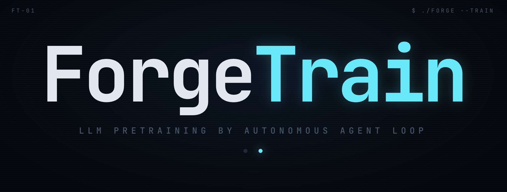

<p align="center">
  
</p>

# ForgeTrain

### 由自主 Agent Loop 端到端产出的 LLM 预训练框架 + 配套 Harness 脚手架 *(即将开源)*

**🤖 100% AI 自动编写 · 🚀 H100 上 MFU 44.13% · 📈 较 Megatron-LM 提升约 10% · ✅ 生产环境验证 · 📄 [论文](./assets/forgetrain_paper.pdf)**

[English](./README.md) | [中文](./README_zh.md)

---

> **一个由 AI Agent Loop 全自动产出、零人工改码的 LLM 预训练框架，外加产出预训练框架的 Harness 脚手架 (即将开源)。**
>
> **当前版本：v0.1.0**（NVIDIA H100 · MiniCPM4-0.5B / MiniCPM4-8B 训练框架；配套 Harness *即将开源*）

---

## ✨ 项目亮点

- 🤖 **100% Agent Loop 自主产出** — 整个框架由 AI Agent 在 auto-loop 模式下自主产出，零人工改码
- 🔄 **自诊断 Agent Loop** — 读基线 → 实现 → 起作业 → 读日志 → 定位根因 → 改代码 → 过门控 → commit，全程自主
- 🚀 **H100 上 MFU 44.13%** — 较 Megatron-LM 基线（~40%）高出约 10%，在 64× H100、BF16、DP-only 上验证
- ✅ **生产环境验证** — MiniCPM4-0.5B 完整预训练，产出可用模型权重（非 demo）
- 🛠️ **GEMM 与 Attention 算子 Agent Loop 自驱产出** — **算子最高 MFU 达到 90%**；FlashAttention 完全自研，性能超越 Transformer Engine / FA3，对标 FA4

---

## 🗺️ Roadmap

- **复现实况 Demo**
- **华为 MiniCPM5-1B 训练框架**
- **训练框架自生成 Harness 脚手架**

---

## 特性对比


| 特性                                       | **ForgeTrain**         | Megatron-LM |
| ---------------------------------------- | ----------------------- | ----------- |
| H100 上 MFU（MiniCPM4-0.5B, BF16, DP）      | **44.13%**              | ~40%        |
| 100% AI 自动编写                             | ✅                       | ❌           |
| CuTeDSL 自定义 GEMM（AOT C-export）           | ✅（5 个 GEMM）             | ❌           |
| 自定义 Flash Attention（对标 FA4）              | ✅（CuTeDSL 自研实现）         | ❌（用 TE / FA）  |
| Checkpoint → HuggingFace 导出              | ✅（一键脚本）                 | 手动          |


<sub>同时也支持 CUDA Graph、Triton 融合算子、通信计算 overlap 等常见加速能力。</sub>

> 对比基于同硬件（H100, SM90）上的 Megatron-LM v0.15。ForgeTrain v1 范围限定为 MiniCPM4-0.5B（DP-only）与 MiniCPM4-8B（TP=2）× BF16；Megatron-LM 支持更多模型和并行策略。

---

## 📢 动态

- 📌 **[2026-05] ForgeTrain v0.1.0 发布** — 首个公开版本，包含完整训练引擎；产出它的 Harness 脚手架 *即将开源*。MiniCPM4-0.5B 在 64× H100 上预训练，达到 **44.13% MFU**。

---

## 目录

- [项目亮点](#-项目亮点)
- [Roadmap](#-roadmap)
- [特性对比](#特性对比)
- [动态](#-动态)
- [Agent 友好快速部署](#-agent-友好快速部署)
- [仓库结构](#仓库结构)
- [快速开始](#快速开始)
- [核心技术](#核心技术)
- [性能](#性能)
- [参与贡献](#参与贡献)
- [License](#license)
- [致谢](#致谢)
- [引用](#引用)

---

## 🤖 Agent 友好快速部署

> 本仓库由 AI Agent 产出，对 AI Agent 也最友好。**把下面的 prompt 粘贴到 Cursor / Claude Code / Codex / Cline**，它会自动读 README、装依赖、跑冒烟测试并报告 MFU，无需你逐条敲命令。

**🟢 5 步最小预训练 demo（粘贴到你的 Coding Agent）**

```text
根据本项目的 exports/train_engine_0.5B/README.md，
在当前节点上跑一个 5 步最小预训练 demo：

1. 检查环境（Python ≥ 3.11, CUDA ≥ 12.x, H100, PyTorch ≥ 2.4），
   缺什么装什么；
2. 安装仓库：pip install -e . 及 HF 依赖：pip install datasets transformers；
3. 导入冒烟测试：
   PYTHONPATH=src python -c "from training_engine_tensor import config; print('OK')"
4. 在 HF GSM8K 上跑 5 步：
   torchrun --standalone --nproc-per-node=1 \
     -m training_engine_tensor pretrain \
     --num-steps 5 --global-batch-size 1 --micro-batch-size 1 \
     --seq-length 4096 \
     --hf-dataset openai/gsm8k --hf-dataset-config main \
     --hf-text-template "Question: {question}\nAnswer: {answer}" \
     --tokenizer-path openbmb/MiniCPM4-0.5B \
     --save-dir ./checkpoints/demo
5. 打印最终 loss、step time 和 MFU。

如果有任何失败，自行排查源码——不要问我。
```

> 完整的单节点 8× H100 及多节点命令见下方[快速开始](#快速开始)章节。

---

## 仓库结构

本仓库包含一组「**生产者 / 产物**」关系的子项目：


| 子目录                          | 角色                                                                                     |
| ---------------------------- | -------------------------------------------------------------------------------------- |
| `harness/` *(即将开源)*          | **Harness** — 驱动 Agent Loop 全自动生产训练框架的脚手架                                              |
| `exports/train_engine_0.5B/` | **TrainingEngine (0.5B)** — 由 `harness/` *(即将开源)* 端到端产出，针对 MiniCPM4-0.5B 在 8× H100 上达到 44.13% MFU |
| `exports/train_engine_8b/`   | **TrainingEngine (8B)** — 同样由 `harness/` *(即将开源)* 产出，针对 MiniCPM4-8B、TP=2 / DP=4 在 8× H100 单机达到 50.9% MFU |


```
 harness/  ──(bash agent-loop.sh, 零人工干预)──▶  exports/train_engine_0.5B/
  Harness  (即将开源)                              exports/train_engine_8b/
  生产者（门控 + Prompt + 控制平面）                产物（可直接用于预训练的训练框架）
```

每个子目录都有独立的 README，包含完整 CLI 文档、配置参考、目录结构、性能基线和限制说明。

---

## 快速开始

> **环境要求**：Python ≥ 3.11 · CUDA 12.x · **PyTorch ≥ 2.4** · NVIDIA H100 80GB (SM90)。完整预训练需 8× H100；早期对齐阶段单卡可跑。

直接使用训练框架 → `exports/train_engine_0.5B/`

---

### 使用训练框架

**目标**：拿现成的训练框架在你的 H100 上跑预训练。

#### 1. 安装

```bash
git clone https://github.com/OpenBMB/ForgeTrain.git
cd ForgeTrain/exports/train_engine_0.5B
pip install -e .
pip install datasets transformers   # HuggingFace 数据通路（必装）
```

#### 2. 安装验证

```bash
PYTHONPATH=src python -c "from training_engine_tensor import config; print('OK')"
```

预期输出：`OK`

#### 3. 算子预编译（首次运行；后续复用 cache）

```bash
PYTHONPATH=src CUSTOM_GEMM=1 OP_ATTENTION=v1 \
    python scripts/precompile_ops.py
```

预热 5 个 CuTeDSL GEMM 的 AOT export + `cpp_extension` 编译，产物落盘到 `${ENGINE_ROOT}/.persist_cache/`。后续训练复用 cache，dlopen 仅需几秒。

#### 4. 单节点 8× H100，使用 HF 数据集

```bash
torchrun --standalone --nproc-per-node=8 \
    -m training_engine_tensor pretrain \
    --num-steps 200 \
    --global-batch-size 1280 --micro-batch-size 10 \
    --seq-length 4096 \
    --hf-dataset openai/gsm8k \
    --hf-dataset-config main \
    --hf-text-template "Question: {question}\nAnswer: {answer}" \
    --tokenizer-path openbmb/MiniCPM4-0.5B \
    --save-dir ./checkpoints/run1
```

`--hf-dataset` 可接 HuggingFace Hub 名（如 `openai/gsm8k`）或本地 Parquet / Arrow / JSON 目录。

**预期输出（8× H100 跑 200 步）**

每步日志格式如下：

```
[STEP 200] loss=X.XXX | step_time=XXXms | mfu=44.XX%
```

在 8× H100 BF16 下，GBS=1280 / MBS=10 / seq=4096 预期 **MFU ~44%**。

> 完整文档包括多节点训练、断点续训、HuggingFace 格式导出 → [`exports/train_engine_0.5B/README_zh.md`](./exports/train_engine_0.5B/README_zh.md) · [`exports/train_engine_8b/README_zh.md`](./exports/train_engine_8b/README_zh.md)

---

## 核心技术

### `harness/` — 让 Agent 自动产出训练框架的脚手架 *(即将开源)*

- **零人工 Agent Loop** — `bash agent-loop.sh` 把 Coding Agent 关在Prompt 之间循环跑，全程不需要人介入
- **两段式门控收敛**：
  - **Stage 1 (M1-M6)** — 前向 / 反向逐位对齐 → DP=8 多步训练 → 长程统计门控（长训 loss 相对差 < 1%，MFU(standard) ≥ 36%）
  - **Stage 2** — 逐算子 CUDA kernel 优化，每算子 30 轮独立 Agent + 最优 MFU 选举，每次合并跑 DP=8 长训集成门控
- **可移植到任何参考训练栈** — 本复现用 Megatron-LM v0.15 / torch，任何暴露同样 env 契约的栈（DeepSpeed / 自研）均可直接替换

### `exports/train_engine_0.5B/` — Agent 自动写出来的训练框架（0.5B）

- **CUDA Graph × 5 种捕获粒度** — forward / step / step_full / step_optimizer / step_nccl_opt，可与 BucketedGradReducer / sharded optimizer / wgrad-overlap 自由组合
- **Triton 融合算子** — 单 kernel 完成 CE fwd+bwd / SwiGLU / RMSNorm+residual / RoPE / fused Adam+param sync
- **自演化的优化空间** — Agent 自动遍历对比 CuTeDSL / cuBLAS / Triton / TransformerEngine 算子实现，以及十几种通信 + CUDA Graph 捕获策略，在真实分布式作业里同时看 MFU 和 loss 对齐；生产默认值即 Agent 自选的最优解

### `exports/train_engine_8b/` — Agent 自动写出来的训练框架（8B）

- **MiniCPM4-8B 单机训练** — 8× H100、`tensor_model_parallel_size=2`，达到 **50.9% MFU**，较 Megatron-LM 基线提升约 8%

---

## 性能


| 指标         | ForgeTrain | Megatron-LM（基线） |
| ---------- | ----------- | --------------- |
| **MFU**    | **44.13%**  | ~40%            |
| **MFU 提升** | **+10%**    | —               |


> 测试条件：MiniCPM4-0.5B · 64× H100 · BF16 · DP-only。

> 完整性能指南 → [`exports/train_engine_0.5B/README_zh.md`](./exports/train_engine_0.5B/README_zh.md) · [`exports/train_engine_8b/README_zh.md`](./exports/train_engine_8b/README_zh.md)

---

## 参与贡献

欢迎各种形式的贡献！

- 🐛 **Bug 报告** — [提 issue](https://github.com/OpenBMB/ForgeTrain/issues)
- 💡 **Feature 建议** — [提 issue](https://github.com/OpenBMB/ForgeTrain/issues)，标题加 `[feature]`
- 📝 **复现报告** — 分享你在不同环境下复现 Agent Loop 的经验
- 🔧 **Pull Request** — 代码改进、文档修复、新模型支持

---

## License

采用 [Apache License 2.0](./LICENSE) 协议。

`exports/train_engine_0.5B/src/quack/` 与 `exports/train_engine_8b/src/quack/` 是 vendored 自上游快照，保留其原作者版权头部，详见 [`exports/train_engine_0.5B/src/quack/NOTICE.md`](./exports/train_engine_0.5B/src/quack/NOTICE.md) 与 [`exports/train_engine_8b/src/quack/NOTICE.md`](./exports/train_engine_8b/src/quack/NOTICE.md)。构建在参考训练栈（本次复现用 Megatron-LM v0.15）与 Cursor Coding Agent 之上；数据和 tokenizer 沿用 MiniCPM4-0.5B / MiniCPM4-8B 上游。

---

## 致谢

ForgeTrain 构建在以下优秀开源项目之上：

- [CUTLASS](https://github.com/NVIDIA/cutlass) / [CuTeDSL](https://github.com/NVIDIA/cutlass) — CuTeDSL GEMM 及辅助工具
- [FlashAttention-4](https://github.com/Dao-AILab/flash-attention)（Dao-AILab）— FA4 CuTeDSL SM90 注意力算子
- [TransformerEngine](https://github.com/NVIDIA/TransformerEngine)（NVIDIA）— 参考算子实现
- [Megatron-LM](https://github.com/NVIDIA/Megatron-LM)（NVIDIA）— 门控验证用参考训练栈
- [Cursor](https://cursor.com) — 编写训练引擎的 Coding Agent
- [MiniCPM4](https://github.com/OpenBMB/MiniCPM)（OpenBMB）— 目标模型架构与 tokenizer

---

## 引用

如果本项目对你有帮助，欢迎引用：

```bibtex
@misc{forgetrain2026,
  title  = {ForgeTrain: Forging Production-Grade Training Frameworks via Harness-Driven AI Development},
  author = {Zhu, Zhui and He, Qingfeng and Li, Shangzhan and Chen, Yaojian and Sun, Haojun and Li, Zhen and Li, Yuxuan and Liu, Zhiyuan},
  year   = {2026},
  url    = {https://github.com/OpenBMB/ForgeTrain}
}
```

---

## 硬件 / 软件基线


| 项目      | 要求                                    |
| ------- | ------------------------------------- |
| GPU     | NVIDIA H100 80GB（SM90, Hopper）        |
| GPU 数量  | 完整门控 / 预训练需 8× H100；早期对齐 1× H100      |
| CUDA    | 12.x                                  |
| PyTorch | ≥ 2.4                                 |
| Python  | ≥ 3.11                                |
| 已验证范围   | MiniCPM4-0.5B（DP-only） / MiniCPM4-8B（TP=2） × H100 × BF16 |


