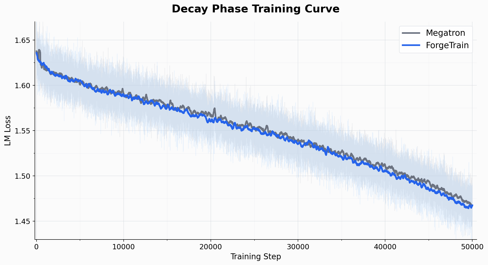

# ForgeTrain Engine

### An LLM Pretraining Framework Built End-to-End by an Autonomous Agent Loop

**🤖 100% AI-Authored · 🚀 44.13% MFU on H100 · 📈 +10% over Megatron-LM · ✅ Production-Validated**

> Subproject of the [ForgeTrain](../../README.md) monorepo.

[English](./README.md) | [中文](./README_zh.md)

[License](../../LICENSE)
[Python](https://www.python.org)
[CUDA](https://developer.nvidia.com/cuda-toolkit)
[PyTorch](https://pytorch.org)
[GPU](https://www.nvidia.com/en-us/data-center/h100/)
[MFU](#performance)

[HuggingFace](https://huggingface.co/<org>)
[ModelScope](https://modelscope.cn/<org>)
[Docs](./docs)
[Discord](https://discord.gg/<invite>)

⭐ Star this repo if you find it useful · 🤝 Built on the shoulders of CUTLASS, FlashAttention-4 & TransformerEngine

---

**TrainingEngine** is an LLM pretraining framework targeting H100 (SM90). **The framework code (excluding code ported from upstream Dao-AILab FlashAttention-4 / NVIDIA CuTeDSL) was written, debugged, and optimized end-to-end by an AI Agent Loop, with zero manual code edits.** Using MiniCPM4-0.5B as the target workload, it trains stably on H100 and delivers **a ~10% MFU lift over the Megatron-LM baseline**, with **pretraining completed and usable model weights produced**.

---

## ✨ Highlights

### 🤖 Built by AI, Validated by Production

- **100% Agent-Loop Authored** — The entire framework was produced by an AI Agent running in auto-loop mode. Humans only supplied the training objective and the hardware budget; **no manual code edits, no manual hyperparameter tuning, no manual bug fixes**.
- **Self-Diagnosing Agent Loop** — The Agent autonomously executes the full loop: read baseline scripts / milestones → implement → launch a job → read logs → locate root cause → patch code — **all without human intervention for debugging**.
- **End-to-End Production-Validated** — Not a demo. A real model was trained: full pretraining of MiniCPM4-0.5B completed on 64× H100, model weights produced; checkpoint round-trip / async save / cursor-resume are all covered by unit tests. As an example, the decay phase ends with a final loss gap of just 0.001 (see the training curve below).

  <p align="center"></p>

### 🚀 Faster than Megatron-LM

- **MFU 44.13%, ~10% above the Megatron-LM baseline (MFU ~40%)** (test conditions: 64× H100, MTP disabled).
- **Self-built GEMM and FlashAttention** — GEMMs are fully self-built and wired into the main path, outperforming cuBLAS; FlashAttention is also self-built, outperforming Transformer Engine / FA3 and on par with FA4.
- **Self-explored optimization space** — In auto-loop the Agent enumerated and benchmarked CuTeDSL / cuBLAS / Triton / TransformerEngine operator variants plus dozens of comm + graph-capture combinations (wgrad-overlap / sharded-optimizer / step-graph / accum-stream) in real distributed jobs measuring both MFU and loss alignment; **the production defaults are the optimum the Agent picked from the full grid**.

---

## 🤖 Agent-Friendly Quick Deploy

> This repo was produced by an AI Agent and is friendliest to AI Agents. **Paste the prompt below into Cursor / Claude Code / Codex / Cline** — it will read the README, install dependencies, run the smoke test and report the MFU, without you typing commands one at a time.

### 🟢 5-step minimal pretraining demo (fastest install check)

```text
Following https://raw.githubusercontent.com/<org>/training_engine/main/README.md,
run a 5-step minimal pretraining demo on the current node:

1. Check the environment (Python ≥ 3.11, CUDA ≥ 12.x, H100, PyTorch ≥ 2.4)
   and install anything missing;
2. Install the repo: pip install -e . and HF deps: pip install datasets transformers;
3. Import smoke test:
   PYTHONPATH=src python -c "from training_engine_tensor import config; print('OK')"
4. Run 5 steps on HF GSM8K:
   torchrun --standalone --nproc-per-node=1 \
     -m training_engine_tensor pretrain \
     --num-steps 5 --global-batch-size 1 --micro-batch-size 1 \
     --seq-length 4096 \
     --hf-dataset openai/gsm8k --hf-dataset-config main \
     --hf-text-template "Question: {question}\nAnswer: {answer}" \
     --tokenizer-path openbmb/MiniCPM4-0.5B \
     --save-dir ./checkpoints/demo
5. Print the final loss, step time, and MFU.

If anything fails, dig into the source on your own — do not ask me.
```

> Full single-node 8× H100 and multi-node commands are in the **Quick Start** section below.

---

## Directory Layout

```
train_engine_0.5B/
  src/
    training_engine_tensor/        # Framework core (Python + CUDA + Triton)
      __main__.py                  # CLI entry (pretrain / train subcommands)
      train_loop.py                # Main training loop
      forward.py / backward.py     # Forward / backward
      forward_graph.py             # Forward CUDA Graph capture
      step_graph*.py               # Step-level CUDA Graphs (4 granularities)
      cuda_graph_utils.py          # CUDA Graph utilities
      optimizer.py / parameters.py # Adam + parameter management
      kernels.py                   # Operator dispatch shims
      triton_kernels.py            # Triton fused kernels
      custom_gemm.py               # Self-built GEMM path
      data.py / hf_dataloader.py   # Data loading (HuggingFace datasets)
      nccl.py                      # NCCL collectives
      profiling.py                 # Performance profiling
      engine_config.py             # Config hub (EngineConfig frozen dataclass)
      config.py / op_dispatcher.py # model_spec loader + per-op version dispatch
      ENV_WHITELIST.md             # Process-external env var whitelist
      ops/                         # Custom operator subpackage
        attention/                 # Self-built FlashAttention
          fa4_cute/                # FA4 CuTeDSL fwd / bwd (SM90)
          flash_attn_dsl/          # End-to-end CuTeDSL fwd / bwd
          kernel.py / register.toml / env_vars.toml
        gemm_qkv_proj/ ... gemm_output/   # 5 CuTeDSL custom GEMMs
        _gemm_inhouse_jit.py / _gemm_inhouse_kernel.py
    quack/                         # CuTeDSL helpers (attention dep)

  tests/                           # Unit tests

  scripts/                         # Training entries & tools
    entry_hf_pretrain.sh           # HuggingFace dataset training entry
    entry_train.sh / entry_precompile.sh
    precompile_ops.py              # Operator precompile
    bench_attention_bwd.py         # Attention backward benchmark
    convert_to_hf.py               # ckpt → HuggingFace format

  job_specs/smoke/                 # Sample distributed job specs
    hf_gsm8k_8gpu_p1.json          # 8× H100 + HuggingFace GSM8K demo
    stable_16gpu_gbs320_p1.json    # 16× H100 stable pretraining

  docs/environment.md              # Full environment & dependency manifest
  model_spec.toml                  # Model architecture spec (used by config.py)
  pyproject.toml / ruff.toml       # Package definition + lint config
  remote-run.sh                    # Remote scheduler entry
```

---

## 🚀 Quick Start

> Full environment & dependency manifest: [`docs/environment.md`](./docs/environment.md). Short form: `Python ≥ 3.11` · `CUDA ≥ 12.x` · `PyTorch ≥ 2.4` · `H100 (SM90)`.

### 1. Install

```bash
git clone https://github.com/<org>/training_engine.git
cd training_engine
pip install -e .

# HuggingFace data path (required)
pip install datasets transformers
```

### 2. Verify install

```bash
PYTHONPATH=src python -c "from training_engine_tensor import config; print('OK')"
```

### 3. Precompile operators (first run; subsequent runs reuse the cache)

```bash
PYTHONPATH=src CUSTOM_GEMM=1 OP_ATTENTION=v1 \
    python scripts/precompile_ops.py
```

Warms up AOT export + `cpp_extension` builds for the 5 CuTeDSL GEMMs, persisting under `${ENGINE_ROOT}/.persist_cache/`. Subsequent training jobs reuse the cache and only pay a few seconds of `dlopen` cost.

### 4. Single-node training (8× H100, bring your own HF dataset)

```bash
torchrun --standalone --nproc-per-node=8 \
    -m training_engine_tensor pretrain \
    --num-steps 200 \
    --global-batch-size 1280 --micro-batch-size 10 \
    --seq-length 4096 \
    --hf-dataset <YOUR_HF_DATASET> \
    --tokenizer-path <YOUR_TOKENIZER> \
    --save-dir ./checkpoints/run1
```

`--hf-dataset` accepts either a **HuggingFace Hub name** (e.g. `openai/gsm8k`) or a **local dataset directory** (Parquet / Arrow / JSON / JSONL). Pick one of two ways to declare the text field:

- `--hf-text-field <COLUMN>` — take a single column directly (e.g. `text`)
- `--hf-text-template "..."` — concatenate multiple columns with Python `.format` syntax (e.g. `"Question: {question}\nAnswer: {answer}"`)

### 5. Multi-node training (any scheduler)

Every node runs the same command; only `NODE_RANK` / `MASTER_ADDR` differ. Works with `torchrun` / Kubernetes PyTorchJob / Slurm / Ray:

```bash
torchrun --nnodes=$NNODES --node_rank=$NODE_RANK --nproc-per-node=8 \
    --master_addr=$MASTER_ADDR --master_port=29500 \
    -m training_engine_tensor pretrain \
    --num-steps 100000 \
    --global-batch-size 1280 --micro-batch-size 10 --seq-length 4096 \
    --hf-dataset <YOUR_HF_DATASET> \
    --tokenizer-path <YOUR_TOKENIZER> \
    --save-interval 5000 \
    --save-dir <SHARED_FS_DIR>/run1
```

### 6. Resume from a checkpoint

```bash
training_engine_tensor train \
    --resume <SHARED_FS_DIR>/run1/step_NNNNNNN \
    --num-steps 200000 \
    --hf-dataset <YOUR_HF_DATASET> \
    --tokenizer-path <YOUR_TOKENIZER> \
    --save-dir <SHARED_FS_DIR>/run1
```

A single `training_state.pt` file bundles BF16 model + FP32 optimizer + dataloader cursor; rank 0 writes asynchronously.

### 7. Export to HuggingFace format

```bash
python scripts/convert_to_hf.py \
    --input <SHARED_FS_DIR>/run1/step_NNNNNNN \
    --output ./hf_model
```

> A PyTorchJob spec you can fork and adapt: [`job_specs/smoke/hf_gsm8k_8gpu_p1.json`](./job_specs/smoke/hf_gsm8k_8gpu_p1.json) (HuggingFace GSM8K demo, 8× H100, 50 steps).

---

## 📦 Models & Versions

### Supported models


| Model             | Params | Architecture                                         | HuggingFace                             | ModelScope                          |
| ----------------- | ------ | ---------------------------------------------------- | --------------------------------------- | ----------------------------------- |
| **MiniCPM4-0.5B** | 0.5 B  | 24-layer Transformer · GQA (16Q/2KV) · SwiGLU · RoPE | [🤗 link](https://huggingface.co/<org>) | [link](https://modelscope.cn/<org>) |


### Hardware


| GPU                    | Arch          | Status                             |
| ---------------------- | ------------- | ---------------------------------- |
| **NVIDIA H100 (80GB)** | SM90 (Hopper) | ✅ Adapted and production-validated |


---

## Operator Stack

The production default enables all 6 custom operators plus fused RMSNorm backward:


| Env var                 | Production default | Description                     |
| ----------------------- | ------------------ | ------------------------------- |
| `CUSTOM_GEMM`           | `1`                | Enable the custom-GEMM dispatch |
| `OP_ATTENTION`          | `v1`               | FA4 CuTeDSL forward + backward  |
| `OP_GEMM_QKV_PROJ`      | `v1`               | AOT C-export QKV GEMM           |
| `OP_GEMM_ATTN_OUT_PROJ` | `v1`               | AOT C-export attn-out GEMM      |
| `OP_GEMM_FC1`           | `v1`               | AOT C-export FC1                |
| `OP_GEMM_FC2`           | `v1`               | AOT C-export FC2                |
| `OP_GEMM_OUTPUT`        | `v1`               | AOT C-export output / LM head   |
| `USE_FUSED_NORM_BWD`    | `1`                | Fused Triton RMSNorm backward   |


---

## CLI

```
python -m training_engine_tensor {pretrain,train,checkpoint-train-loop} ...
```

- `pretrain` — from-scratch training
- `train` — resume from a checkpoint with `--resume <dir>`
- `checkpoint-train-loop` — micro-bench mode that runs a fixed set of step indices against pre-loaded weights + tokenized inputs

For env-var configuration see `src/training_engine_tensor/ENV_WHITELIST.md`. Anything not on the whitelist must flow through `EngineConfig`.

